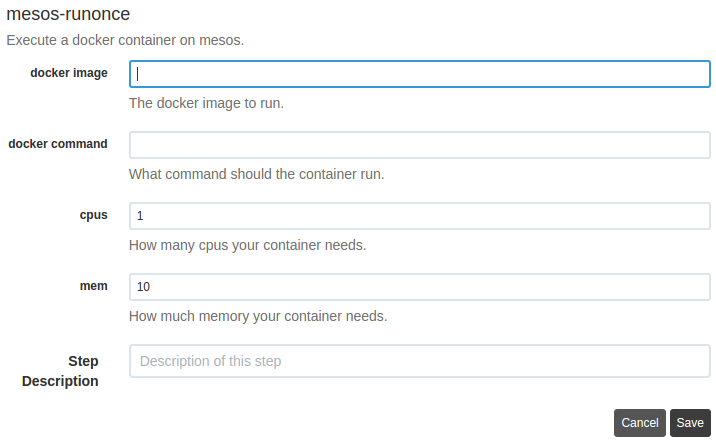

# mesos-runonce-rundeck
Rundeck interface for mesos-runonce framework. Adds a new "Workflow Step" to a
rundeck job called "mesos-runonce". This will allow a user to enter in their
docker image name, command to run in the container, how many cpus they want,
and how much memory they want.

# Usage
To get this working you will need:

- A rundeck server
- [mesos-runonce](https://github.com/yp-engineering/mesos-runonce) available in
  the rundeck server's $PATH
- This plugin's .zip file either from the
  [releases](https://github.com/yp-engineering/mesos-runonce-rundeck/releases)
  (Coming soon), or by cloning and running `make`.
- Installing this plugin's .zip file into the rundeck server's plugin path
  (usually $RDECK_BASE/libext).

Once this is setup appropriately, you will need to supply the following env
variables so that the
[mesos-runonce.sh](mesos-runonce/contents/mesos-runonce.sh) script can use
them.

- $HOSTNAME - Hostname or IP of rundeck server so mesos can connect back.
- $MESOS_MASTER - The current mesos master.
- $MESOS_PRINCIPLE - The principal used if using mesos framework auth.
- $MESOS_SECRET - The secret used if using mesos framework auth.
